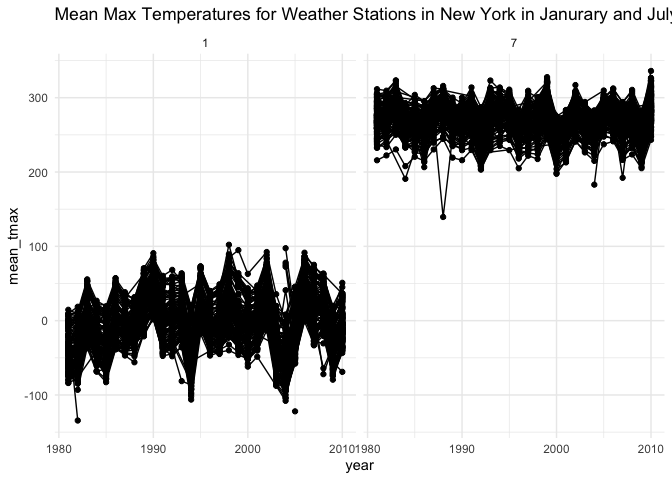
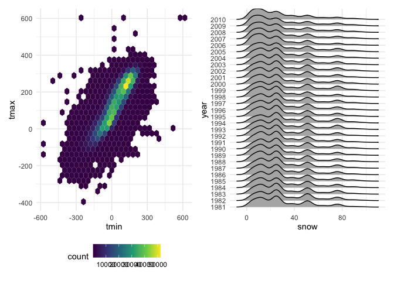
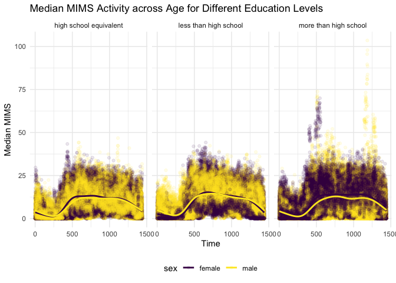

P8105 HW3
================
Zeqi Li
2024-10-14

# Problem 1

## Load dataset

``` r
data("ny_noaa")
```

The NY NOAA dataset contains 2595176 rows and 2595176 columns. This
dataset describes the weather in New York using variables such as date
of observation, precipitation, snowfall, snow depth, max temperature,
and min temperature.

## Question 1

``` r
ny_noaa =
  ny_noaa |> 
  mutate(tmax = as.numeric(tmax),
         tmin = as.numeric(tmin)) |> 
  separate(date, into = c("year", "month", "day"), convert = TRUE)
```

To tidy up the dataset, `mutate()` is first applied to convert the
`tmax` and `tmin` from `chr` data type to `num` data type. Then,
`separate()` is applied to split the `date` variable into `year`,
`month`, and `day` columns.

``` r
snow_count = 
  ny_noaa |> 
    count(snow) |> 
    arrange(desc(n))
```

The most common values in the snowfall column is zero-es. There are
2008508 zero-es in that column, mainly because there are many days in a
year when there is no snow in New York. Another noticeable common value
is the NAs. There are 381221 NA values in the snowfall column.

## Question 2

``` r
ny_noaa |> 
  group_by(id, year, month) |> 
  filter(month %in% c(1, 7)) |> 
  summarize(mean_tmax = mean(tmax, 
                             na.rm = TRUE,
                             color = id)) |> 
  ggplot(aes(x = year,
             y = mean_tmax,
             group = id)) +
  geom_point() +
  geom_path() +
  facet_grid(~ month) +
  labs(title = "Mean Max Temperatures for Weather Stations in New York in Janurary and July across years")
```

<!-- -->

Overall, we can see that the average max temperatures in July are higher
than those in January, as expected. The max temperatures in all stations
fluctuate in the same stable range across the years, as we can clearly
see all the lines following the same trend of up and downs.

There are also a few outliers. For example, in the plot for January,
there were observations below -100 F in 1982, 1994, and 2004; in the
plot for July, there were sobservations below 150 F in 1988, 2004, and
2007.

## Question 3

``` r
hex = 
  ny_noaa |> 
  ggplot(aes(x = tmin,
             y = tmax)) +
  geom_hex() +
  theme(legend.position = "bottom") +
  viridis::scale_color_viridis(discrete = TRUE)

ridge = 
  ny_noaa |> 
  filter(snow > 0, snow < 100) |> 
  ggplot(aes(x = snow,
             y = as.factor(year))) +
  geom_density_ridges() + 
  ylab("year")

hex + ridge
```

<!-- --> On the graph
above, the plot on the left shows a hex plot of max temperature versus
min temperature. Hexagons with lighter colors indicate that those areas
on the plot have more data, and hexagons with darker colors indicate
that those areas have less amount of data. In general, we can see that
most data cluster at the center of the plot, and `tmax` and `tmin`
follows a roughly directly proportional relationship.

The plot of the right shows a ridge plot of distributions of snowfall
over the years, for snowfall amount greater than 0 and less than 100. In
general, snowfall amounts follow a multi-modal distribution, where the
amounts peak at around 10, 25, 50, and slightly at 75. This
multi-modality is likely because of the conversion of measurements from
the imperial system to the metric system.

# Problem 2

## Load and tidy up data

``` r
demograph = 
  read_csv("data/nhanes_covar.csv",
           skip = 4) |> 
  janitor::clean_names() |> 
  drop_na() |> 
  filter(age > 20) |> 
  mutate(sex = case_match(sex,
                          1 ~ "male",
                          2 ~ "female"),
         education = case_match(education,
                                1 ~ "less than high school",
                                2 ~ "high school equivalent",
                                3 ~ "more than high school"))
  
accel = read_csv("data/nhanes_accel.csv") |> 
  janitor::clean_names()
```

## Merge datasets

``` r
mims = 
  demograph |> 
  left_join(accel,
            by = "seqn") |> 
  pivot_longer(min1:min1440,
               names_to = "time",
               names_prefix = "min",
               values_to = "mims") |> 
  mutate(time = as.numeric(time))
```

## Create table

``` r
edu_sex_df = 
  mims |> 
  count(sex, education) |> 
  pivot_wider(names_from = "education",
              values_from = "n")

knitr::kable(edu_sex_df)
```

| sex    | high school equivalent | less than high school | more than high school |
|:-------|-----------------------:|----------------------:|----------------------:|
| female |                  33120 |                 40320 |                 84960 |
| male   |                  50400 |                 38880 |                 80640 |

Comment

## Aggregate MIMS data and plot

``` r
aggr_mims = 
  mims |> 
  group_by(seqn, age, sex, education) |> 
  summarize(mims_per_day = sum(mims))
```

    ## `summarise()` has grouped output by 'seqn', 'age', 'sex'. You can override
    ## using the `.groups` argument.

``` r
aggr_mims |> 
  ggplot(aes(x = age,
             y = mims_per_day,
             color = sex)) +
  geom_point() +
  geom_smooth(se = FALSE) +
  facet_grid(~ education) +
  labs(title = "Total MIMS Activity across Age for Different Education Levels") +
  ylab("total MIMS")
```

    ## `geom_smooth()` using method = 'loess' and formula = 'y ~ x'

<!-- -->

Comment

# Problem 3

## Import data

``` r
jan_20 = read_csv("data/Jan 2020 Citi.csv")
jan_24 = read_csv("data/Jan 2024 Citi.csv")
july_20 = read_csv("data/July 2020 Citi.csv")
july_2024 = read_csv("data/July 2020 Citi.csv")
```
