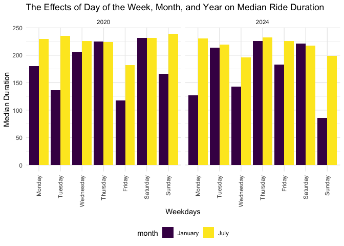

P8105 HW3
================
Zeqi Li
2024-10-14

# Problem 1

## Load dataset

``` r
data("ny_noaa")
```

The NY NOAA dataset contains 2595176 rows and 2595176 columns. This
dataset describes the weather in New York using variables such as date
of observation, precipitation, snowfall, snow depth, max temperature,
and min temperature.

## Question 1

``` r
ny_noaa =
  ny_noaa |> 
  mutate(tmax = as.numeric(tmax),
         tmin = as.numeric(tmin)) |> 
  separate(date, into = c("year", "month", "day"), convert = TRUE)
```

To tidy up the dataset, `mutate()` is first applied to convert the
`tmax` and `tmin` from `chr` data type to `num` data type. Then,
`separate()` is applied to split the `date` variable into `year`,
`month`, and `day` columns.

``` r
snow_count = 
  ny_noaa |> 
    count(snow) |> 
    arrange(desc(n))
```

The most common values in the snowfall column is zero-es. There are
2008508 zero-es in that column, mainly because there are many days in a
year when there is no snow in New York. Another noticeable common value
is the NAs. There are 381221 NA values in the snowfall column.

## Question 2

``` r
ny_noaa |> 
  group_by(id, year, month) |> 
  filter(month %in% c(1, 7)) |> 
  summarize(mean_tmax = mean(tmax, 
                             na.rm = TRUE,
                             color = id)) |> 
  ggplot(aes(x = year,
             y = mean_tmax,
             group = id)) +
  geom_point() +
  geom_path() +
  facet_grid(~ month) +
  labs(title = "Mean Max Temperatures for Weather Stations in New York in Janurary and July across years")
```

<!-- -->

Overall, we can see that the average max temperatures in July are higher
than those in January, as expected. The max temperatures in all stations
fluctuate in the same stable range across the years, as we can clearly
see all the lines following the same trend of up and downs.

There are also a few outliers. For example, in the plot for January,
there were observations below -100 F in 1982, 1994, and 2004; in the
plot for July, there were sobservations below 150 F in 1988, 2004, and
2007.

## Question 3

``` r
hex = 
  ny_noaa |> 
  ggplot(aes(x = tmin,
             y = tmax)) +
  geom_hex() +
  theme(legend.position = "bottom") +
  viridis::scale_color_viridis(discrete = TRUE)

ridge = 
  ny_noaa |> 
  filter(snow > 0, snow < 100) |> 
  ggplot(aes(x = snow,
             y = as.factor(year))) +
  geom_density_ridges() + 
  ylab("year")

hex + ridge
```

<!-- --> On the graph
above, the plot on the left shows a hex plot of max temperature versus
min temperature. Hexagons with lighter colors indicate that those areas
on the plot have more data, and hexagons with darker colors indicate
that those areas have less amount of data. In general, we can see that
most data cluster at the center of the plot, and `tmax` and `tmin`
follows a roughly directly proportional relationship.

The plot of the right shows a ridge plot of distributions of snowfall
over the years, for snowfall amount greater than 0 and less than 100. In
general, snowfall amounts follow a multi-modal distribution, where the
amounts peak at around 10, 25, 50, and slightly at 75. This
multi-modality is likely because of the conversion of measurements from
the imperial system to the metric system.

# Problem 2

## Load and tidy up data

``` r
demograph = 
  read_csv("data/nhanes_covar.csv",
           skip = 4) |> 
  janitor::clean_names() |> 
  drop_na() |> 
  filter(age > 20) |> 
  mutate(sex = case_match(sex,
                          1 ~ "male",
                          2 ~ "female"),
         education = case_match(education,
                                1 ~ "less than high school",
                                2 ~ "high school equivalent",
                                3 ~ "more than high school"))
  
accel = read_csv("data/nhanes_accel.csv") |> 
  janitor::clean_names()
```

## Merge datasets

``` r
mims = 
  demograph |> 
  left_join(accel,
            by = "seqn") |>
  drop_na()
```

## Create table

``` r
edu_sex_df = 
  mims |> 
  count(sex, education) |> 
  pivot_wider(names_from = "education",
              values_from = "n") |> 
  relocate("sex",
           "less than high school",
           "high school equivalent",
           "more than high school")

knitr::kable(edu_sex_df,
             caption = "Sex and Education Level Table")
```

| sex    | less than high school | high school equivalent | more than high school |
|:-------|----------------------:|-----------------------:|----------------------:|
| female |                    28 |                     23 |                    59 |
| male   |                    27 |                     35 |                    56 |

Sex and Education Level Table

In the categories of “less than high school level” and “more than high
school level”, there are slightly more women than men. But there are
significantly more men than women with a high school equivalent level.

## Plot age distributions

Visualizing age distribution for men and women in each education level.

``` r
mims |> 
  group_by(age,
           sex,
           education) |> 
  ggplot(aes(x = education,
             y = age,
             fill = sex)) +
  geom_boxplot() +
  labs(title = "Age Distributions in Men and Women across Education Levels") +
  xlab("Education Level") + 
  ylab("Age")
```

<!-- --> In the
boxplots above, we can see that in the education category “high school
equivalent”, the median age for women is around 60 and the median age
for men is around 50; in the education category “less than high school”,
the median ages for both men and women are around 60; in the education
category “more than high school”, the median age for both men and women
are around 40. From this observation, we note that younger participants
tend to have a higher education level. In addition, the age
distributions of men and women in the “high school equivalent” have a
more drastic difference than those in the other two categories.

## Aggregate MIMS data and plot

``` r
aggr_mims = 
  mims |> 
  pivot_longer(min1:min1440,
               names_to = "time", 
               names_prefix = "min",
               values_to = "mims") |> 
  group_by(time, sex, education, mims) |> 
  mutate(time = as.numeric(time)) |> 
  summarize(mean_mims = mean(mims))

aggr_mims |> 
  ggplot(aes(x = time,
             y = mean_mims,
             color = sex)) +
  geom_point(alpha = 0.3) +
  geom_smooth(se = FALSE) +
  facet_grid(~ education) +
  labs(title = "Mean MIMS Activity across Age for Different Education Levels") +
  ylab("Mean MIMS") +
  xlab("Time")
```

<!-- -->

# Problem 3

## Import data

``` r
jan_20 = read_csv("data/Jan 2020 Citi.csv") |> 
  mutate(month = "January",
         year = "2020")

jan_24 = read_csv("data/Jan 2024 Citi.csv") |> 
  mutate(month = "January",
         year = "2024")

july_20 = read_csv("data/July 2020 Citi.csv") |> 
  mutate(month = "July",
         year = "2020")

july_24 = read_csv("data/July 2024 Citi.csv") |> 
  mutate(month = "July",
         year = "2024")

citi = bind_rows(jan_20,
                 jan_24,
                 july_20,
                 july_24)
```

## Create table

Table showing total number of rides in each combination of year and
month separating casual riders and Citi Bike members.

``` r
member_casual = 
  citi |> 
  group_by(year,
           month,
           member_casual) |> 
  count(member_casual) |> 
  pivot_wider(names_from = "member_casual",
              values_from = "n")
  
knitr::kable(member_casual,
             caption = "Total Number of Rides from Casual Riders and Members across
             Years and Months")
```

| year | month   | casual | member |
|:-----|:--------|-------:|-------:|
| 2020 | January |    984 |  11436 |
| 2020 | July    |   5637 |  15411 |
| 2024 | January |   2108 |  16753 |
| 2024 | July    |  10894 |  36262 |

Total Number of Rides from Casual Riders and Members across Years and
Months

## Top 5 Start Stations

``` r
top_stations = 
  july_24 |> 
  count(start_station_name) |> 
  arrange(desc(n)) |>
  head(5)

knitr::kable(top_stations,
             caption = "Top 5 Start Stations")
```

| start_station_name       |   n |
|:-------------------------|----:|
| Pier 61 at Chelsea Piers | 163 |
| University Pl & E 14 St  | 155 |
| W 21 St & 6 Ave          | 152 |
| West St & Chambers St    | 150 |
| W 31 St & 7 Ave          | 146 |

Top 5 Start Stations

## Effect of day of the week, month, and year on median ride durations

``` r
median_duration = 
  citi |> 
  group_by(weekdays, year, month, duration) |> 
  summarize(median_duration = median(duration)) 
```

    ## `summarise()` has grouped output by 'weekdays', 'year', 'month'. You can
    ## override using the `.groups` argument.

``` r
median_duration |> 
  ggplot(aes(x = weekdays,
             y = median_duration,
             fill = month)) + 
  geom_bar(stat = "identity",
           position = "dodge") +
  theme(axis.text.x = element_text(angle = 90,
                                   vjust = 0.5,
                                   hjust = 1))  +
  facet_grid(~ year)
```

<!-- -->

## Effect of month, membership status, and bike type on ride duration

``` r
bike_type = 
  citi |> 
  filter(year == "2024") |> 
  group_by(rideable_type, month, member_casual, duration)
    

bike_type |> 
  ggplot(aes(x = month,
             y = duration,
             fill = member_casual)) + 
  geom_bar(stat = "identity",
           position = "dodge")
```

<!-- -->
